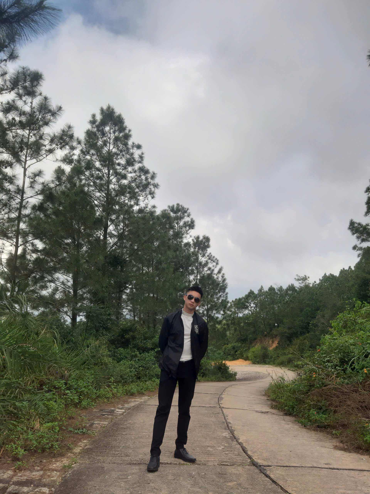

<!-- # <p align="center"> </p> -->
<h1 align="center">
    <a href="https://git.io/typing-svg"></a>
</h1>

<br>
 
<p align="center">
	<a href="https://github.com/nguyentay52636">
	
	</a>
</p>

<br>

<!-- <h2 align="center">About me</h2> -->

<!-- ```C#
class NgocTien
namespace NgocTien
{
    class ngoctien
    {
        static void Main(string[] args)
        {
       
    }
}
``` -->

<p align="center">
  Hi, I'm  Phương Tây, Software Developer from VietNam
  <br>
  🔬 I am currently a student majoring in Software Engineering at SGU-University Of Science
  <br>
  💻 I love writing code and learn anythings about it
  <br>
  💬 Ask me anything about from <a href="https://www.facebook.com/profile.php?id=61556701409917" title="Issues">Here</a>
  <br>
  📫 How to reach me: <a href="mailto:phuongtay52636@gmail.com"> <a href="mailto: phuongtay52636@gmail.com">phuongtay52636@gmail.com</a>
  <br>

</p>

## <p align="center">You can reach me at 🌹</p>

<p align="center">
  <a href="https://www.facebook.com/profile.php?id=61556701409917">
    
  </a>
	
  <a href="https://github.com/NgocTien0110">
    
  </a>
  
  <a href="mailto:kayonkiu@gmail.com">
    
  </a>
	
  <a href="https://www.instagram.com/ngoc.tien10/">
    
  </a>
  
  <a href="https://www.tiktok.com/@ngoctien10">
    
  </a>
  
  <a href="https://www.youtube.com/channel/UC4VhNS-FaM2MckjSwaDATeA">
    
  </a>
</p>

<br>

<!-- 

## <p align="center">What I use :alien:</p>

<p align="center"> 


</p>

<br>

## <p align="center">Editor/IDE use ✍️ </p>

<p align="center"> 


</p>

<br>

 -->

## <p align="center">Visitor's count :eyes:</p>

<p align="center"></p>

<br>

## <p align="center">GitHub Profile Trophy 🏆</p>

<p align='center'>
<!--  -->
</p>

<br>

## <p align="center">Profile stats :musical_keyboard:</p>

<p align="center">
	<!-- <a align="center"></a> -->
	<a align="center"></a>
</p>

<br>

<!-- ## <p align="center">Github Contributions 📈</p>

<p align='center'>

<p>

<br > -->

## <p align="center">Just a snake eating my contributions 🐍</p>

<!-- <p align='center'>

</p> -->

<br>

##

<p align="center"></p>
